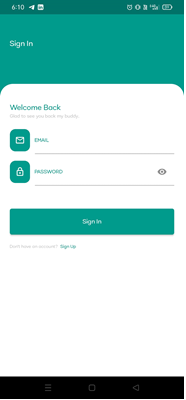
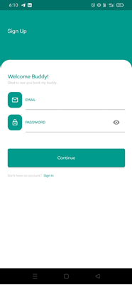
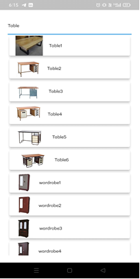
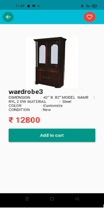

# FurnitureSalesApp
Ecommerce furniture Sales Mobile Application
**Tech Stack:** Dart, Firebase, Android Studio, Razorpay

## Overview:
This mobile application was developed to streamline the online sales process for a steel furniture manufacturing business. It provides a seamless user experience for browsing and purchasing products with secure payment integration.

## Key Features:
- **User Authentication:** Secure registration and login system to protect user data.
- **Product Browsing & Filtering:** Users can browse through a variety of steel furniture products, with filtering options for better navigation.
- **Shopping Cart & Checkout:** Seamless cart functionality for adding products, with an integrated checkout system for entering shipping details.
- **Payment Gateway Integration:** Integrated Razorpay for secure payment processing via credit/debit card.
- **Firebase Integration:** Used Firebase for reliable data storage and retrieval, ensuring consistency and reducing manual effort in data management.

## Installation:
1. Clone this repository.
2. Open the project in **Android Studio**.
3. Ensure **Firebase SDK** is set up and configured.
4. Run the app on an emulator or physical device.

